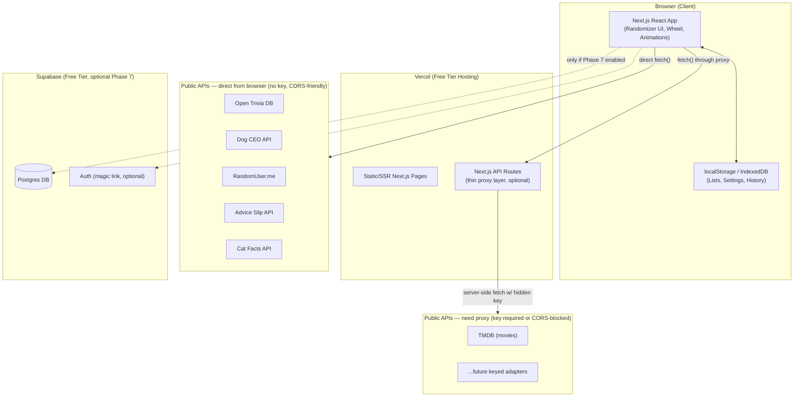
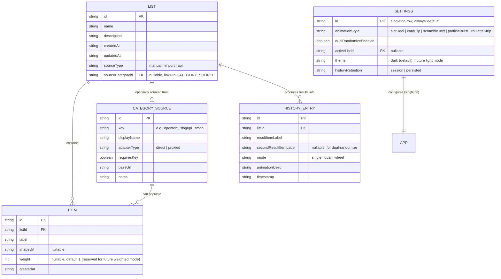

# Randomizer — Build Plan, ERD & Implementation Guide

## Assumptions (stated up front, per your instructions)

1. **Auth is out of scope for v1.** Since this is a "handful of users" app, I'm assuming no login is required for the local-first version. If cross-device sync is wanted later (Phase 7), Supabase Auth (magic link) is the lightest option and is included as optional.
2. **"CSV import" means simple single-column CSV** (one item per row, optionally quoted) — not multi-column spreadsheets with metadata. Multi-column CSV (e.g., item + weight/image) is called out as a stretch goal.
3. **Weighted randomization is out of scope** unless you want it added — the spec describes uniform random selection. I've left a hook for weights in the ERD in case you want it later.
4. **"Pulled from a connected API category" items are ephemeral by default** — they populate a temporary list the user can then "Save as list" if they want to keep it. They aren't auto-persisted.
5. **Dual-randomize "two picks, no repeat" applies within a single randomize action**, not across history — i.e., pick A and pick B in the same trigger can't be the same item, but a later trigger can repeat prior results.
6. **Wheel mode reuses the same list data as the standard randomizer** — it's a different *visualization/selection mode*, not a separate data model.
7. **Target scale is small** (single-digit to low-hundreds of users, lists of up to a few hundred items) — this justifies free-tier everything and local-first storage.

If any of these assumptions are wrong, flag them and I'll adjust the plan before you hand this to a coding agent.

---

## 1. Feature Summary Table

| Feature | Requires Backend? | Why |
|---|---|---|
| Create/manage lists (manual entry) | No | localStorage/IndexedDB is sufficient for a single device |
| CSV/.txt file import | No | Parsed entirely client-side |
| Randomize (single pick) | No | Pure client-side logic |
| Dual-randomize mode | No | Pure client-side logic |
| History (session-based) | No | In-memory / localStorage |
| History (persisted across devices) | **Yes (optional, Phase 7)** | Needs a database to survive device changes |
| Animation system (5 styles) | No | Client-side rendering/CSS/canvas only |
| Circular wheel mode | No | Client-side rendering only |
| API adapters — no-key, CORS-friendly APIs (trivia, dog breeds, random user, advice, cat facts) | No | Called directly from the browser |
| API adapters — key-required or CORS-blocked APIs (e.g., TMDB) | **Yes** | Must proxy through a Next.js API route to hide the key / bypass CORS |
| Settings (animation choice, dual-mode toggle, category management) | No | localStorage is enough per device |
| Cross-device list sync / sharing a list via link | **Yes (optional, Phase 7)** | Requires a database + a way to identify "whose" data it is |

**Bottom line:** the only *required* backend usage is a thin serverless proxy for any API that needs a hidden key or has no CORS support. Everything else can — and by default will — stay 100% client-side. A database is entirely optional and only justified if you want persistence across devices or sharable lists.

---

## 2. System Architecture



**Key points:**
- The frontend is the app for v1. It talks to `localStorage`/`IndexedDB` for all persistence and directly `fetch()`s the no-key/CORS-friendly public APIs.
- Next.js API routes exist solely as a **thin proxy** for the handful of APIs that need a hidden key or don't support CORS. This is the *only* required backend code.
- Supabase is drawn in as an **optional** later phase (Phase 7) — not part of the critical path.

---

## 3. Entity Relationship Diagram

Everything below the line `-- LOCAL ONLY (v1) --` lives in `localStorage`/`IndexedDB` as JSON — there is no real "database" until Phase 7. The ERD models it as tables anyway because that's the cleanest way to specify shape, and because it maps directly onto a future Supabase Postgres schema if you add persistence later (Phase 7 tables reuse these exact fields plus a `user_id`).



**Notes on the model:**
- `ITEM.weight` is included but unused in v1 — it's there so a future "weighted randomization" feature doesn't require a schema migration.
- `CATEGORY_SOURCE` rows are largely **static/config-driven** in v1 (a list of built-in adapters), not something users create from scratch — but modeling it as a table keeps the adapter pattern data-driven rather than hardcoded in UI components.
- `HISTORY_ENTRY` is scoped to a `listId` so history can be filtered per list or shown globally.
- If Phase 7 (Supabase) is implemented, every table above gains a `user_id FK` and RLS (row-level security) policies scoping rows to their owner.

---

## 4. Tech Stack Recommendation

| Layer | Choice | Why | Free-tier docs |
|---|---|---|---|
| Framework | **Next.js (App Router)** | Lets you ship a mostly-static app now, add API routes only where genuinely needed, and deploy for free on Vercel | https://nextjs.org/docs |
| Language | TypeScript | Type safety for the adapter pattern and animation-strategy interfaces | — |
| Styling | Tailwind CSS | Fast to build the dark/teal dashboard aesthetic with consistent design tokens | https://tailwindcss.com/docs |
| Animation | Framer Motion (+ CSS/Canvas for particle effects) | Covers reel spin, card flip, glow pulses, and wheel easing without heavy custom physics code | https://www.framer.com/motion/ |
| Client persistence | `localStorage` for settings/small lists, **IndexedDB** (via `idb` library) for larger lists/history | Keeps everything local-first with no backend required for v1 | https://developer.mozilla.org/en-US/docs/Web/API/IndexedDB_API |
| Hosting (frontend) | **Vercel free tier** | Native Next.js support, generous free tier, zero-config API routes | https://vercel.com/docs/limits/overview |
| Backend/DB (optional, Phase 7) | **Supabase free tier** (Postgres + Auth) | Free Postgres with RLS and magic-link auth if you want cross-device sync later | https://supabase.com/pricing |
| File parsing | `papaparse` for CSV | Handles quoted fields, trims, and edge cases without hand-rolled parsing | https://www.papaparse.com/ |

**Free-tier limits worth knowing before you build:**
- **Vercel Hobby (free):** 100 GB bandwidth/month, serverless function execution capped (generous for a proxy layer used by a handful of users), no custom SLA. No cold-start "sleep" behavior for the frontend itself, but serverless functions do have brief cold starts.
- **Supabase free tier:** 500 MB database storage, project pauses after 1 week of inactivity (auto-resumes on next request, with a short delay) — worth knowing if this sits idle between demos.
- **Open Trivia DB / Dog CEO / RandomUser.me / Advice Slip / Cat Facts:** all free, no key, no published hard rate limit for light personal use — but no formal SLA either, so build in a graceful "API unavailable, try again" state.

---

## 5. Recommended Default API Categories

| Category | API | Needs Proxy? | Notes |
|---|---|---|---|
| Trivia questions | Open Trivia DB (`opentdb.com`) | No | No key, CORS-friendly, good default "fun" category |
| Dog breeds/images | Dog CEO API (`dog.ceo`) | No | No key, CORS-friendly, great for demoing image-based items |
| Random names/people | RandomUser.me | No | No key, CORS-friendly, useful for "pick a random person" style lists |
| Advice snippets | Advice Slip API | No | No key, CORS-friendly, single-string results are simple to animate |
| Cat facts | Cat Facts API (`catfact.ninja`) | No | No key, CORS-friendly, lightweight second "fun fact" category |
| Movies | TMDB | **Yes** | Requires a free API key; TMDB's CORS policy and key requirement mean this must go through a Next.js API route that injects the key server-side |

Start with the five no-key adapters for Phase 6 (they get the adapter pattern proven with zero backend), then add TMDB as the first "proxied" adapter to validate that path before deciding whether more keyed integrations are worth the backend complexity.

---

## 6. Folder / File Structure

```
randomizer/
├── app/
│   ├── layout.tsx
│   ├── page.tsx                     # main randomizer screen
│   ├── wheel/
│   │   └── page.tsx                 # circular wheel mode
│   ├── settings/
│   │   └── page.tsx
│   └── api/
│       └── proxy/
│           └── [source]/
│               └── route.ts         # thin proxy for keyed/CORS-blocked APIs (e.g. TMDB)
│
├── components/
│   ├── randomizer/
│   │   ├── RandomizeButton.tsx
│   │   ├── ResultDisplay.tsx
│   │   ├── DualResultDisplay.tsx
│   │   └── HistoryPanel.tsx
│   ├── wheel/
│   │   ├── PrizeWheel.tsx
│   │   └── wheelPhysics.ts
│   ├── animations/                  # pluggable animation strategies
│   │   ├── AnimationRegistry.ts     # maps style key -> component
│   │   ├── SlotReelAnimation.tsx
│   │   ├── CardFlipAnimation.tsx
│   │   ├── ScrambleTextAnimation.tsx
│   │   ├── ParticleBurstAnimation.tsx
│   │   └── RouletteStripAnimation.tsx
│   ├── lists/
│   │   ├── ListManager.tsx
│   │   ├── ListEditor.tsx
│   │   └── FileImportDialog.tsx
│   ├── settings/
│   │   ├── AnimationPicker.tsx
│   │   ├── DualModeToggle.tsx
│   │   └── CategoryManager.tsx
│   └── ui/                          # shared dark-theme primitives (Card, Button, Toggle, etc.)
│
├── lib/
│   ├── storage/
│   │   ├── listsStore.ts            # IndexedDB CRUD for lists/items
│   │   ├── settingsStore.ts         # localStorage CRUD for settings
│   │   └── historyStore.ts
│   ├── adapters/                    # API adapter pattern
│   │   ├── AdapterInterface.ts      # fetchRandomItem / fetchList contract
│   │   ├── openTriviaAdapter.ts
│   │   ├── dogApiAdapter.ts
│   │   ├── randomUserAdapter.ts
│   │   ├── adviceSlipAdapter.ts
│   │   ├── catFactsAdapter.ts
│   │   ├── tmdbAdapter.ts           # calls /api/proxy/tmdb internally
│   │   └── adapterRegistry.ts
│   ├── csv/
│   │   └── parseImportFile.ts       # papaparse wrapper + validation/cleanup
│   └── random/
│       └── pickRandom.ts            # core selection logic incl. no-repeat dual-pick
│
├── types/
│   ├── list.ts
│   ├── item.ts
│   ├── settings.ts
│   └── history.ts
│
├── public/
│   └── (icons, wheel pointer graphic, etc.)
│
├── styles/
│   └── globals.css                  # Tailwind base + design tokens (dark theme, teal accent)
│
├── .env.local.example               # TMDB_API_KEY etc.
├── next.config.js
├── tailwind.config.ts
├── tsconfig.json
└── package.json
```

---

## 7. Phased Implementation Plan

Each phase is fully testable on `localhost` before moving to the next. Deployment is the last phase, not a recurring step.

### Phase 0 — Local project scaffold + dev environment
- `create-next-app` with TypeScript + Tailwind + App Router.
- Set up `.env.local.example` (even though nothing needs a key yet — establishes the pattern early).
- Establish design tokens in `tailwind.config.ts`: near-black background, teal/cyan accent, card radius/shadow scale, thin font weights.
- **Local check:** app boots on `localhost:3000`, dark theme renders, no console errors.

### Phase 1 — Core randomizer + local storage lists (no backend)
- Build `listsStore.ts` (IndexedDB) and `settingsStore.ts` (localStorage).
- Build list CRUD UI (`ListManager`, `ListEditor`).
- Build `pickRandom.ts` and the base single-pick randomize flow with a plain (no-animation) result display.
- **Local check:** create a list, add items manually, randomize, get a correct uniformly-random result, refresh the page and confirm the list persisted.

### Phase 2 — Animation system (all 5 styles) + settings picker
- Define `AnimationInterface` (a component contract: receives the candidate pool + the chosen winner, calls `onComplete()` when done).
- Implement all five: slot reel, card flip, scramble/glitch text, particle burst/glow, roulette strip.
- Build `AnimationRegistry` so `ResultDisplay` renders whichever style is active without knowing implementation details.
- Build `AnimationPicker` in Settings with a live preview per style.
- **Local check:** every style can be previewed and selected in Settings, and the main Randomize button correctly plays whichever is active; switching styles requires no other code changes.

### Phase 3 — Wheel mode
- Build `PrizeWheel` (SVG or Canvas pie-slices from the active list) + `wheelPhysics.ts` (ease-out spin, pointer landing on the pre-determined winner).
- Handle long lists: auto-shrink label font / truncate with tooltip past a slice-count threshold.
- **Local check:** wheel renders correct slice count for lists of 3, 12, and 50+ items; spin always lands visually on the actual winner (no mismatch between physics and result).

### Phase 4 — File import (CSV/.txt)
- `parseImportFile.ts` using `papaparse` for CSV (handles quoted fields) and a simple newline splitter for `.txt`.
- Validation/cleanup: trim whitespace, drop empty lines, de-duplicate.
- `FileImportDialog` with a preview + confirm step before committing to a list.
- **Local check:** import a messy CSV (blank lines, quoted commas, duplicate rows) and a `.txt` file; confirm the resulting list is clean.

### Phase 5 — Dual-randomize mode
- Extend `pickRandom.ts` to support "two from one list, no repeat" and "one from each of two lists."
- Build `DualResultDisplay` (side-by-side reveal, reusing the same animation components with two candidate pools).
- Add the toggle in Settings (`DualModeToggle`).
- **Local check:** toggle on, run both dual sub-modes, confirm no-repeat constraint holds over many trials, confirm each animation style still works in dual mode.

### Phase 6 — API adapter pattern + first integrations
- Define `AdapterInterface` (`fetchRandomItem`, `fetchList`).
- Implement the five no-key adapters (Open Trivia DB, Dog CEO, RandomUser.me, Advice Slip, Cat Facts) called directly from the browser.
- Build `CategoryManager` UI to pull a list from a connected category and optionally "Save as list."
- **Local check:** pull from each of the five categories, confirm results populate correctly and can be saved as a normal list; simulate an API failure (e.g., throttle network in devtools) and confirm a graceful error state.

### Phase 7 — Backend/DB (only if you want persistence or a keyed API) — optional
- Add the TMDB adapter behind `app/api/proxy/[source]/route.ts` to prove out the proxy pattern with a real keyed API.
- *If* cross-device persistence is wanted: stand up a free Supabase project, mirror the ERD tables with an added `user_id`, add Supabase Auth (magic link), and add a sync layer that pushes/pulls `localStorage`/IndexedDB data to Postgres.
- **Local check:** TMDB proxy returns results without ever exposing the key to the browser (verify in Network tab); if persistence was added, confirm a list created on one browser profile appears after logging in from another.

### Phase 8 — Local QA checklist / full test pass
Before touching deployment, verify on localhost:
- [ ] All 5 animation styles play correctly for single-pick
- [ ] All 5 animation styles play correctly for dual-pick
- [ ] Wheel mode: correct winner, correct slice rendering at small/medium/large list sizes
- [ ] Dual-randomize: both sub-modes (same-list no-repeat, cross-list)
- [ ] CSV import: quoted fields, blank lines, duplicates all handled
- [ ] .txt import: newline splitting, trim, dedupe
- [ ] All 5 no-key API pulls succeed and degrade gracefully on failure
- [ ] TMDB proxy (if built) never leaks the key client-side
- [ ] Settings persist across a page reload
- [ ] History reflects results across all modes
- [ ] Responsive check on a narrow mobile viewport

### Phase 9 — Deployment (final phase)
- Push to GitHub, connect the repo to **Vercel** (free tier), set `TMDB_API_KEY` (if used) as a Vercel environment variable — never commit it.
- If Supabase was added: create the production Supabase project, run migrations, set `NEXT_PUBLIC_SUPABASE_URL`/`SUPABASE_ANON_KEY` as Vercel env vars.
- Smoke-test the deployed URL against the same Phase 8 checklist.
- Document the deployed free-tier limits (Vercel bandwidth, Supabase pause-on-inactivity) somewhere visible so future-you isn't surprised.

---

## 8. UI Direction Notes

- **Palette:** near-black background (`#0a0e12`–`#0f1419` range), card panels a shade lighter with a subtle border (`#161b22`-ish), single accent color in teal/cyan (`#2dd4bf`–`#22d3ee` range) used sparingly — buttons, active states, glow effects, winner highlight.
- **Typography:** thin-to-regular weights (300–400) for body text, a slightly heavier weight (500–600) only for the result reveal and headings, so the "reveal" moment visually stands out against otherwise quiet UI.
- **Cards:** rounded corners (`rounded-xl`/`rounded-2xl`), soft shadow, generous internal padding — think analytics dashboard panel, not a game show marquee.
- **Motion:** consistent easing curves across all 5 animation styles and the wheel (e.g., a shared `ease-out` cubic-bezier for "landing" moments) so switching styles in Settings never feels like a different app.
- **Glow/particle effects:** reserve the teal glow for the *moment of reveal only* — it should read as a payoff, not ambient decoration, or it will fight with the minimal aesthetic elsewhere.
- **Whitespace:** avoid dense controls; the settings panel and list manager should feel like distinct, breathable dashboard "widgets," not a cluttered form.

---

This plan is ready to hand to a coding agent phase-by-phase. I'd suggest starting a fresh agent session per phase (0 → 9) rather than one long session, since each phase has its own clean "local check" you can verify before moving on.
